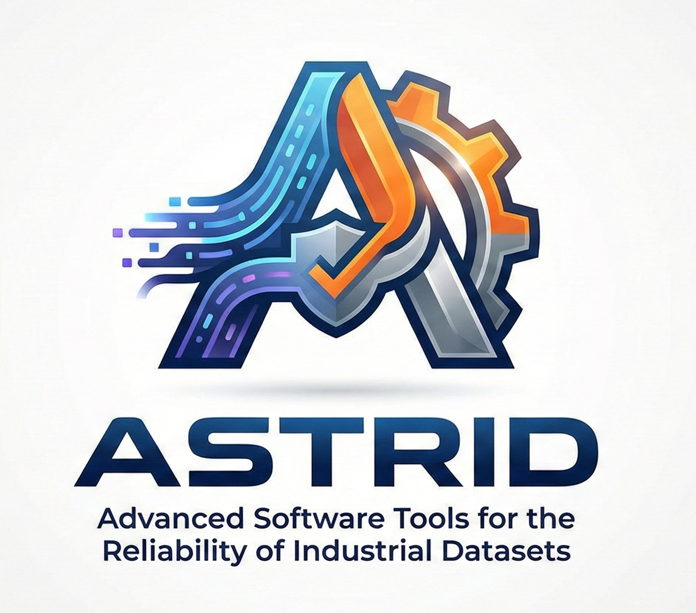

# ASTRID

  

**ASTRID** stands for **Advanced Software Tools for Reliable Industrial Datasets**.  
The project delivers open-source software components and metrics to assess and improve the reliability of datasets used in industrial AI systems.

ASTRID focuses on practical dataset checks that support safer, fairer, and more dependable AI in manufacturing and related industrial domains.

---

## Motivation

Industrial AI systems depend heavily on data quality. Issues like bias, hidden identifiers, label leakage, missing values, or unstable sensor streams often remain undetected until late deployment stages.

ASTRID provides tools that help engineers and researchers answer simple but critical questions:

- Can this dataset be trusted for training and validation?
- Does data quality degrade model performance in safety-relevant cases?
- Are there hidden risks that standard pipelines fail to detect?

---

## Scope

ASTRID targets datasets commonly used in industrial environments, including:

- Time-series sensor data and logs  
- Industrial image datasets  
- Synthetic and simulated data  

The tools are designed for use in real production-oriented settings, not only research labs.

---

## Core Features

- Dataset reliability checks for industrial AI tasks
- Detection of bias, imbalance, and information leakage
- Support for multiple data modalities
- Metrics linked to model behavior under noisy or incomplete data
- Transparent algorithms with user-configurable parameters
- Resource-efficient design suitable for operational environments

---

## Project Structure

Planned components include:

- Modular analysis library
- Dataset validation pipelines
- Benchmark datasets and examples
- Documentation and usage guides
- Reproducible experiments

The repository will grow incrementally as components mature.

---

## Relation to Standards and Regulation

ASTRID aligns its metrics and checks with current and emerging European requirements, including:

- Trustworthy AI principles
- Data protection constraints
- Industrial safety expectations

The project aims to offer early technical references that support compliance efforts in practice.

---

## Status

This repository represents the starting point of the ASTRID project.

Initial releases will include:
- Core reliability metrics
- Example datasets
- Reference experiments

Development is ongoing.

---

## License

All software developed in ASTRID is released under an open-source license.  
License details will be added once the initial modules are published.

---

## Acknowledgements

ASTRID is developed within the scope of European research and innovation activities focused on trustworthy AI for industry.

Further details on funding and collaborations will be added as the project progresses.

