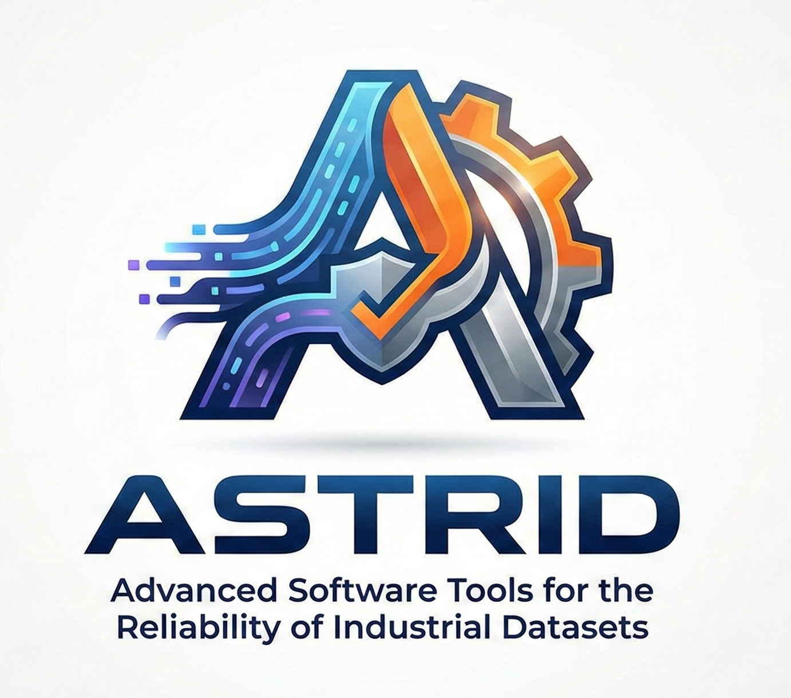

<p align="center">
  
</p>

<h1 align="center">ASTRID</h1>

<p align="center">
  <strong>Advanced Software Tools for Reliable Industrial Datasets</strong><br>
  Open-source tooling to assess and improve the reliability of datasets used in industrial AI systems.
</p>

<p align="center">
  
  
  
  
</p>

---

## Table of Contents

1. [What is ASTRID?](#what-is-astrid)
2. [Key Features](#key-features)
3. [Architecture](#architecture)
4. [The Five Reliability Dimensions](#the-five-reliability-dimensions)
5. [Installation](#installation)
6. [Quick Start](#quick-start)
7. [Customising Metric Weights](#customising-metric-weights)
8. [Analyzers Reference](#analyzers-reference)
9. [Health Score & Grading](#health-score--grading)
10. [Configuration Reference](#configuration-reference)
11. [Exporting Results](#exporting-results)
12. [Standards Alignment](#standards-alignment)
13. [Contributing](#contributing)
14. [License](#license)
15. [Citation](#citation)
16. [Acknowledgements](#acknowledgements)

---

## What is ASTRID?

Industrial AI systems are only as reliable as the data they are trained and validated on. Yet in practice, datasets used in manufacturing, energy, healthcare, and other safety-critical sectors routinely suffer from hidden problems: missing values that accumulate silently across sensor channels, label leakage between training and test splits, personally-identifiable information embedded in column names, distribution drift across production batches, and demographic disparities that surface only after deployment. Detecting and quantifying these issues before a model reaches production is both technically difficult and frequently neglected.

ASTRID provides a unified, browser-based quality-assessment platform for three of the most common data modalities in industrial AI: tabular datasets (CSV, Parquet, Excel), time-series recordings, and image archives (ZIP files). Each analyzer runs a comprehensive battery of checks spanning data quality, security, reliability, robustness, and fairness—and synthesises the results into a single, interpretable health score together with a letter grade and a ranked list of remediation recommendations.

The tool is aimed at ML engineers who want a fast first-pass audit before committing a dataset to a training run, data scientists who need evidence of dataset fitness for regulated applications, and AI safety teams responsible for documenting compliance with emerging standards such as the EU AI Act and ISO/IEC 25012. ASTRID is intentionally dependency-light and runs entirely locally: no data is sent to external services, making it suitable for confidential or commercially-sensitive datasets.

Within a broader MLOps workflow, ASTRID fits naturally at the data-validation gate that precedes model training. Its JSON export can be stored as a dataset artefact alongside model cards and experiment metadata, enabling reproducible audits and drift monitoring across dataset versions.

---

## Key Features

- **Multi-modal support** — dedicated analyzers for tabular data (CSV/Parquet/Excel), time-series (CSV/Parquet), and image datasets (ZIP archives with optional metadata CSV).
- **Five reliability dimensions** — every dataset is evaluated across Quality, Security, Reliability, Robustness, and Fairness, each with multiple concrete checks.
- **Configurable metric weights** — users can adjust the contribution of each dimension to the composite health score directly from the sidebar, with automatic normalisation so values do not need to sum to exactly 100.
- **Automated recommendations** — after each analysis run ASTRID generates a prioritised list of plain-language remediation actions.
- **HTML report export** — a self-contained HTML report can be downloaded after every analysis and shared with colleagues or archived as compliance evidence.
- **PII detection** — heuristic regex-based scanning flags columns or file paths that may contain personally-identifiable information such as email addresses, phone numbers, and national identifiers.
- **Drift detection** — Kolmogorov–Smirnov statistics measure distribution shift between data slices (e.g., first vs. last temporal segment), flagging datasets where the underlying distribution has changed.
- **Fairness analysis** — group-level disparity checks measure positive-rate differences across protected or demographic subgroups, surfacing potential bias before training.
- **Split-leakage detection** — row-hash and perceptual-hash cross-split checks identify samples that appear in both training and test partitions.
- **Transparency scoring** — dataset documentation completeness and traceability coverage are measured and included in the overall score (image analyzer).

---

## Architecture

```
astrid/
├── app.py                       # Streamlit home / landing page
├── utils.py                     # Shared utilities, scoring engine, CSS design system
├── pages/
│   ├── 01_Tabular.py            # Tabular dataset analyzer
│   ├── 02_Time_Series.py        # Time-series dataset analyzer
│   ├── 03_Images.py             # Image dataset analyzer
│   └── 04_Drift_experimental.py # Experimental drift tracker
├── docs/                        # Jekyll documentation site
├── requirements.txt
└── logo.png
```

**`app.py`** is the Streamlit entry point and renders the landing page with navigation cards for each analyzer.

**`utils.py`** is the shared library imported by every page. It contains the CSS design system, the `compute_health_score` scoring engine (with `DEFAULT_WEIGHTS`), helper functions for HTML report generation, PII pattern matching, statistical utilities, and common widget renderers.

Each **page module** (`01_Tabular.py`, `02_Time_Series.py`, `03_Images.py`) is self-contained: it defines its own data-model dataclasses, check functions, verdict logic, recommendation builder, and Streamlit layout—while delegating scoring and styling to `utils.py`.

---

## The Five Reliability Dimensions

| Dimension | Default Weight | What it measures | Key checks performed |
|-----------|---------------|------------------|----------------------|
| **Quality** | 35 % | Structural correctness and completeness of the data | Missingness rate, exact duplicate rows, split leakage (row-hash), annotation schema consistency, class balance entropy, metadata completeness |
| **Security** | 25 % | Confidentiality and privacy risk | PII heuristic scanning (email, phone, ID patterns), EXIF GPS metadata in images, suspicious sample detection, source-concentration HHI |
| **Reliability** | 20 % | Temporal and distributional stability | Kolmogorov–Smirnov drift between first/last slices, cadence irregularity, duplicate timestamp rate, inter-annotator agreement (Cohen's κ) |
| **Robustness** | 10 % | Resilience to noise and edge cases | MAD-based row anomaly scoring (p99), image-feature outlier rate, condition-coverage gaps across operational subsets |
| **Fairness** | 10 % | Equitable representation across groups | Positive-rate disparity across protected attributes, representation Jensen–Shannon divergence, label-parity gap, missingness disparity by group |

> **Note:** The image analyzer additionally tracks a **Transparency** dimension (documentation completeness and traceability) within its local scoring function. This dimension is not exposed as a user-configurable weight but is included in the displayed property scores.

---

## Installation

### Prerequisites

- Python 3.9 or later
- Git

### Step-by-step

```bash
# 1. Clone the repository
git clone https://github.com/jorge-martinez-gil/astrid.git
cd astrid

# 2. Create and activate a virtual environment
python -m venv .venv
# On Linux / macOS:
source .venv/bin/activate
# On Windows:
.venv\Scripts\activate

# 3. Install core dependencies
pip install -r requirements.txt

# 4. Optional – install extras for richer image analysis
pip install imagehash scikit-learn scipy

# 5. Launch the application
streamlit run app.py
```

The application opens automatically in your default browser at `http://localhost:8501`.

---

## Quick Start

### Tabular and time-series datasets

1. Navigate to **Tabular Analyzer** or **Time Series Analyzer** from the home page.
2. Upload your dataset file (CSV, Parquet, or Excel).
3. In the sidebar, select a **threshold preset** (Balanced / Strict / Lenient) and configure column roles (label, split, time, group).
4. Optionally expand **⚖️ Score Weights** to adjust dimension contributions (see [Customising Metric Weights](#customising-metric-weights)).
5. Click **🔬 Run analysis**.
6. Read the **Verdict** card at the top—it summarises the overall finding, lists the key issues, and shows recommended actions.
7. Explore the dimension tabs (Quality, Security, Reliability, Robustness, Fairness, Transparency, Security) for detailed metric values and evidence.
8. Switch to the **Export** tab and click **⬇ Download HTML** to save a self-contained report.

### Image datasets

1. Navigate to **Image Analyzer** from the home page.
2. Upload a **ZIP file** containing your images. Optionally also upload a **metadata CSV** with label, split, group, and source columns.
3. Configure column roles in the sidebar.
4. Optionally expand **⚖️ Score Weights** to adjust dimension contributions.
5. Click **Run analysis** and wait while ASTRID scans each image.
6. Review the property score bars and detailed tabs. Download the HTML report from the **Export** tab.

---

## Customising Metric Weights

### Default weights

| Dimension   | Default weight |
|-------------|---------------|
| Quality     | 35            |
| Security    | 25            |
| Reliability | 20            |
| Robustness  | 10            |
| Fairness    | 10            |
| **Total**   | **100**       |

### Using the ⚖️ Score Weights sidebar expander

In every analyzer, open the **⚖️ Score Weights** expander in the left sidebar (located just above the Run button). You will see five sliders—one per dimension—each initialised to the default value above.

- Drag any slider to increase or decrease that dimension's contribution.
- A **live sum indicator** shows the current total. If it is not 100, ASTRID displays an amber notice and **automatically normalises** the weights before computing the score, so you never need to make them add up to exactly 100.
- Click **Reset to defaults** to restore all sliders to the values in the table above.

### How normalisation works

Internally, before computing the health score, ASTRID divides each supplied weight by the sum of all weights and multiplies by 100:

```
norm_weight[dim] = weight[dim] / sum(all weights) × 100
```

This means that only the **relative proportions** matter. Setting Quality = 70, Security = 50, Reliability = 40, Robustness = 20, Fairness = 20 gives exactly the same result as setting them to 35, 25, 20, 10, 10.

### Example use cases

- **Security-critical domain (e.g., medical records, financial data):** raise Security to 50 and lower Robustness and Fairness to 5 each. The health score will penalise PII findings more heavily.
- **Academic benchmark where fairness is paramount:** increase Fairness to 40 and lower Security to 10. The score will reflect demographic disparity more strongly.
- **Manufacturing sensor data without labelled groups:** set Fairness to 0 (all weight is redistributed to the other four dimensions automatically).

### Programmatic usage

You can also pass custom weights directly when calling `compute_health_score` from `utils.py`:

```python
from utils import compute_health_score

custom_weights = {
    "quality":     50,
    "security":    30,
    "reliability": 10,
    "robustness":  5,
    "fairness":    5,
}

score, grade, components = compute_health_score(
    report,
    drift_threshold=0.30,
    weights=custom_weights,
)
print(f"Score: {score}  Grade: {grade}")
```

---

## Analyzers Reference

### 01 — Tabular Analyzer

**Accepted file formats:** CSV, Parquet, Excel (`.xls`, `.xlsx`)

**Checks performed:**
- Overall and per-column missingness rate
- Exact duplicate row rate
- Row-hash cross-split leakage (train/test contamination)
- PII heuristic scan across text columns
- Numeric distribution drift (KS statistic, first vs. last temporal slice)
- MAD-based row anomaly scoring
- Group fairness: positive-rate disparity across user-selected group columns
- Inter-annotator agreement (Cohen's κ) when annotator columns are supplied
- Rare-category detection in categorical columns
- Schema consistency across splits

**Output:**
- Verdict card (PASS / WARNING / FAIL) with reasons and recommendations
- Health score ring chart (0–100) with dimension breakdown bars
- Per-dimension detail tabs with metric tables, histograms, and evidence lists
- Downloadable JSON report and self-contained HTML report

---

### 02 — Time Series Analyzer

**Accepted file formats:** CSV, Parquet

**Checks performed:**
- All tabular checks above, with temporal awareness
- Timestamp parsability and duplicate timestamp rate
- Cadence irregularity (coefficient of variation of inter-sample intervals)
- Entity-level statistics when entity columns are selected
- Time-slice mode (day / week / month / quarter) for drift computation

**Output:**
- Same as Tabular Analyzer, plus time-axis health metrics (cadence, gaps)

---

### 03 — Image Analyzer *(Experimental)*

**Accepted file formats:** ZIP archive containing images (JPEG, PNG, BMP, TIFF, WEBP, GIF); optional metadata CSV or Parquet

**Checks performed:**
- Image readability (corrupt / unreadable file detection)
- Resolution audit (low-resolution image rate)
- Exact duplicate detection (MD5 hash) and perceptual near-duplicate detection (pHash, requires `imagehash`)
- Cross-split hash leakage
- Conflicting-label detection on duplicate images
- Class balance (normalised entropy)
- Annotator agreement (Cohen's κ) on annotation files
- KS-based feature drift between temporal slices
- Provenance coverage (source column completeness)
- Image-feature outlier detection (MAD on pixel statistics; Isolation Forest when `scikit-learn` is available)
- Condition-coverage gaps across operational subsets
- Group fairness: missingness disparity, representation JSD, label-parity gap
- Datasheet completeness (documentation fields)
- Traceability coverage (ID column completeness)
- EXIF GPS privacy check
- PII-like pattern detection in file paths and names
- Suspicious sample rate (statistical outlier images)
- Source-concentration HHI (dataset diversity)

**Output:**
- Property score bars for six dimensions (Quality, Reliability, Robustness, Fairness, Transparency, Security)
- Detailed tabs per dimension
- Downloadable HTML report

---

## Health Score & Grading

Every analysis produces an integer **health score** between 0 and 100. The score is the weighted sum of per-dimension raw fractions, where each fraction measures how far that dimension is from ideal (1.0) versus worst-case (0.0).

| Grade | Score range | Meaning |
|-------|-------------|---------|
| **A** | 90 – 100 | Excellent — dataset is production-ready with minor or no issues |
| **B** | 80 – 89  | Good — a few low-severity issues; address before long training runs |
| **C** | 70 – 79  | Acceptable — noticeable issues that should be resolved; proceed with caution |
| **D** | 60 – 69  | Poor — significant problems likely to degrade model performance or safety |
| **F** | 0 – 59   | Failing — critical issues detected; do not use for production training without remediation |

The score breakdown bars on the Overview tab show each dimension's contribution as a percentage of its maximum possible weight.

---

## Configuration Reference

| Parameter | Description | Default |
|-----------|-------------|---------|
| **Threshold preset** | Selects Balanced, Strict, or Lenient threshold profiles for all checks simultaneously | Balanced |
| **Drift KS threshold** | KS statistic above which numeric distribution shift is flagged | 0.30 (Balanced) |
| **PII hit-rate threshold** | Regex hit-rate above which a text column is flagged as potentially containing PII | 0.01 (Balanced) |
| **Label column** | Column containing the prediction target; used for leakage and fairness checks | Auto-detected |
| **Split column** | Column indicating train/val/test membership; used for leakage detection | Auto-detected |
| **Time column** | Column containing timestamps; used for temporal drift and cadence checks | Auto-detected |
| **Group columns** | Columns defining demographic or operational subgroups for fairness analysis | Auto-detected |
| **Random state** | Random seed for any stochastic sub-steps (e.g., sub-sampling for PII scan) | 7 |

Threshold values for Strict and Lenient presets:

| Parameter | Strict | Balanced | Lenient |
|-----------|--------|----------|---------|
| Drift KS threshold | 0.20 | 0.30 | 0.40 |
| PII hit-rate threshold | 0.005 | 0.01 | 0.02 |

---

## Exporting Results

### JSON report

Every analyzer makes the full analysis report available as a structured JSON object. Use the **Export** tab → **⬇ Download JSON** to save it. The JSON captures all metric values, threshold settings, file fingerprints, and per-dimension evidence and is suitable for archiving alongside model cards or experiment tracking systems.

### HTML report

The **⬇ Download HTML** button on the Export tab generates a self-contained HTML file that can be opened in any browser without an internet connection. It includes the verdict, health score, dimension breakdown, and a summary of findings and recommendations. Share this file with stakeholders or attach it to compliance documentation.

---

## Standards Alignment

ASTRID's metrics and checks are designed with the following standards and regulatory frameworks in mind:

| Standard / Framework | Relevance |
|----------------------|-----------|
| **EU AI Act** (Annex IV, Art. 10) | Data governance requirements for high-risk AI: relevance, representativeness, freedom from errors, completeness |
| **ISO/IEC 25012** | Data quality model: completeness, consistency, accuracy, currentness, accessibility, compliance |
| **NIST AI RMF** (GOVERN, MAP, MEASURE, MANAGE) | Dataset risk identification, measurement, and management practices |

ASTRID does not provide legal compliance certification. The outputs are technical evidence to support human-led compliance assessments.

---

## Contributing

Contributions are welcome! To contribute:

1. Fork the repository on [GitHub](https://github.com/jorge-martinez-gil/astrid).
2. Create a feature branch: `git checkout -b feature/my-improvement`.
3. Make your changes and add tests where applicable.
4. Open a pull request describing your changes.

For bug reports and feature requests, please open an issue on the [issue tracker](https://github.com/jorge-martinez-gil/astrid/issues).

---

## License

ASTRID is released under the [MIT License](LICENSE).

---

## Citation

If you use ASTRID in academic work, please cite:

```bibtex
@software{martinez_gil_astrid_2025,
  author    = {Jorge Martinez-Gil},
  title     = {{ASTRID}: Advanced Software Tools for Reliable Industrial Datasets},
  year      = {2025},
  url       = {https://github.com/jorge-martinez-gil/astrid},
  note      = {Open-source dataset reliability assessment platform}
}
```

---

## Acknowledgements

ASTRID is developed within the scope of European research and innovation activities focused on trustworthy AI for industry. Further details on funding and collaborations will be added as the project progresses.

